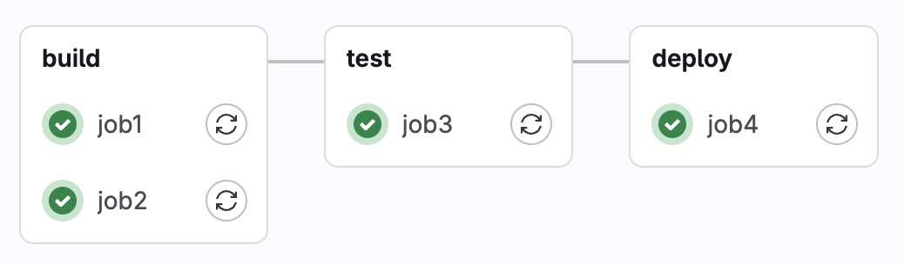

# Übung 2

**Hinweise:**

In dieser Übung verwenden wir GitLab um Deployment-Pipelines zu entwickeln. Die Prinzipien lassen sich jedoch auch mit anderen CI/CD-Diensten entwickeln. GitLab kann entweder auf dem lokalen Rechner installiert werden oder in der Cloud verwendet werden, indem man auf [GitLab.com](http://www.gitlab.com) kostenlos einen Account anlegt. Das Anlegen eines Accounts für diese Übung ist natürlich freiwillig. Anmerkung: Das 30-day-trial bezieht sich nur auf die Ultimate-Variante, alle anderen Dienste können auch darüber hinaus genutzt werden.

Jede der folgenden Aufgaben sollte in einem eigenen Projekt realisiert werden. Wie man Projekte in GitLab anlegt, wird in der Vorlesung noch erklärt.  

Zunächst einmal können Sie das Repository zu Übung 2 über git klonen.  

In diesem Repository finden sie Konfigurationsdateien in YAML, die nach folgendem Schema aufgebaut sind:

   ```bash
aufgabe_n.yml
   ```
Das n ist jeweils eine Ziffer (1,2,3, ...), welche die zugehörige Aufgabe referenziert. Um die Datei in dem jeweiligen Projekt/Repository nutzen zu können, müssen Sie sie folgendermaßen umbenennen:

   ```bash
.gitlab-ci.yml
   ```

**Aufgabe 1 - Eine einfache Deployment-Pipeline**

Legen Sie ein neues Projekt in GitLab an (z.B. aufgabe1). Fügen Sie dem Projekt-Repository den Code aus der Datei aufgabe_1.yml hinzu und speichern Sie ihn unter dem Dateinamen .gitlab-ci.yml (siehe Hinweise oben).  

Comitten Sie die Änderungen und starten Sie die Pipeline.  

Schauen Sie sich die grafische Darstellung der Pipeline sowie ihren Konsolen-Output an.  

Die Pipeline sollte so aussehen:  



a) Wie lange benötigt der Durchlauf dieser Pipeline theoretisch?  

b) Wie lange benötigt der Durchlauf dieser Pipeline tatsächlich?

**Aufgabe 2 - Fehler in Deployment-Pipelines**

Ändern Sie job3 so, dass dieser fehlschlägt und somit die Pipeline abgebrochen wird.

**Aufgabe 3 - Deployment-Pipeline als Directed Acyclic Graph (DAG)**

Ändern Sie die Pipeline aus Aufgabe 1 so, dass job3 bereits dann starten kann, wenn job1 beendet wurde (unabhängig von job2).

a) Wie lange benötigt der Durchlauf dieser Pipeline theoretisch?  

b) Wie lange benötigt der Durchlauf dieser Pipeline tatsächlich?

**Aufgabe 4 - Artifacts**

Artefakte sind in Deployment-Pipelines Job-Erzeugnisse, die entlang einer Stage-Sequenz weitergereicht werden sollen. Zum Beispiel kann dies bei einem Java-Programm zunächst eine .class Datei sein, die nach einem Build-Job an einen Test-Job weitergereicht wird und zum Ende der Pipeline als .jar Datei ausgegeben werden soll. Diese Artefakte müssen explizit in der Konfigurationsdatei der Pipeline definiert werden.  

Legen Sie zunächst ein neues Projekt/Repository für diese Aufgabe an. Fügen Sie dem Repository den Code aus der Datei aufgabe_4.yml als .gitlab-ci.yml Datei hinzu (siehe Hinweise oben).

a) Führen Sie die Pipeline aus und sehen Sie danach unter "Artifacts" nach, welche Dateien die Pipeline erzeugt hat.  

b) Warum wird für job2 keine Datei angelegt?

c) Ändern Sie die Konfigurationsdatei so, dass auch für job2 die entsprechende Datei erzeugt wird.

**Aufgabe 5 - Branches und Umgebungsvariablen**

GitLab hat eine ganze Reihe von [Umgebungsvariablen](https://docs.gitlab.com/ee/ci/variables/predefined_variables.html) um die Entwicklung in verschiedenen Branches zu steuern. So kann man z. B. steuern, dass ein Build auf dem Master-Branch in die Produktionsumgebung deployt wird, ein Build auf dem Release-Branch in die Staging-Umgebung und alle anderen Branches nur in die Test-Umgebung.

Legen Sie zunächst ein neues Projekt/Repository für diese Aufgabe an. Fügen Sie dem Repository den Code aus der Datei aufgabe_5.yml als .gitlab-ci.yml Datei hinzu (siehe Hinweise oben).

a) Legen Sie folgende Branches in ihrem Projekt an:  

- feature  

- master  

- release

b) Schauen Sie sich die Konfigurationsdatei an. Welche Jobs werden auf welchem Branch ausgeführt?

c) Führen Sie die Pipeline in den unterschiedlichen Branches aus und überprüfen Sie damit ihr Ergebnis aus Aufgabe b) 

d) Ändern Sie die Pipeline so, dass job1 nur im feature Branch ausgeführt wird.

**Aufgabe 6 - (Java-)Programmcode kompilieren und ausführen in einer Pipeline**

Legen Sie zunächst ein neues Projekt/Repository für diese Aufgabe an. 
- Fügen Sie dem Repository die Datei HelloWorldBug.java hinzu  
- Fügen Sie dem Repository den Code aus der Datei aufgabe_6.yml als .gitlab-ci.yml Datei hinzu (siehe Hinweise oben).  


a) Wie werden Java-Programme kompiliert und ausgeführt?  
b) Wo finden Sie diese Schritte in der Konfigurationsdatei zu dieser Deployment-Pipeline?  
c) Führen Sie die Pipeline aus. Was passiert? Wo ist der Fehler?  
d) Korrigieren Sie den Fehler und starten Sie die Pipeline erneut. Beide Stages sollten nun erfolgreich passiert werden.  
e) In welchem Fall würde die build-Stage erfolgreich passiert werden, aber die Test-Stage abbrechen? Passen Sie den Quellcode entsprechend an.  

Hinweis: Achten Sie darauf, dass die JDK-Version des GitLab-Servers mit der JDK-Version in der Konfigurationsdatei übereinstimmt.

**Aufgabe 7 - Dependencies in Deployment-Pipelines**

Legen Sie zunächst ein neues Projekt/Repository für diese Aufgabe an. 
- Fügen Sie dem Repository die Dateien Film.java und TestFilm.java hinzu.  
- Fügen Sie dem Repository den Code aus der Datei aufgabe_7.yml als .gitlab-ci.yml Datei hinzu (siehe Hinweise oben).  


a) Welche Abhängigkeiten bestehen zwischen diesen beiden Java-Klassen?  
b) Führen Sie die Pipeline aus und prüfen Sie, ob sie fehlerfrei durchläuft.

**Aufgabe 8 - Software-Tests in Deployment-Pipelines: Ein Beispiel mit JUnit und Hamcrest**

Legen Sie zunächst ein neues Projekt/Repository für diese Aufgabe an.    
- Fügen Sie dem Repository die Dateien FactorialCalculator.java und FactorialCalculatorTest.java hinzu
- Fügen Sie dem Repository die Datei junit-4.12.jar hinzu (Infos zu [JUnit](https://junit.org/junit5/))
- Fügen Sie dem Repository die Datei hamcrest-core-1.3.jar hinzu (Infos zu [Hamcrest](https://hamcrest.org/))
- Fügen Sie dem Repository den Code aus der Datei aufgabe_8.yml als .gitlab-ci.yml Datei hinzu (siehe Hinweise oben) 

a) Erklären Sie, was das Programm FactorialCalculator.java macht.
b) Erklären Sie, was hier getestet wird.
c) Sehen Sie sich die Tests und das Programm an. Was würden Sie als Ausgabe bzw. Test-Ergebnis erwarten?  
d) Testen Sie das Programm, indem Sie die Pipeline ausführen und vergleichen Sie die Ergebnisse mit ihren Einschätzungen aus Aufgabe b).  
